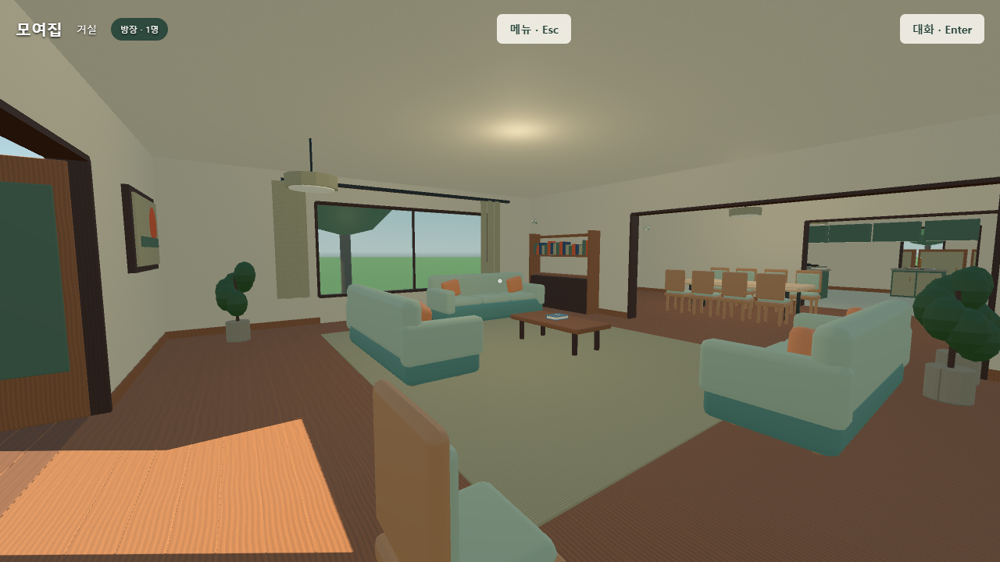
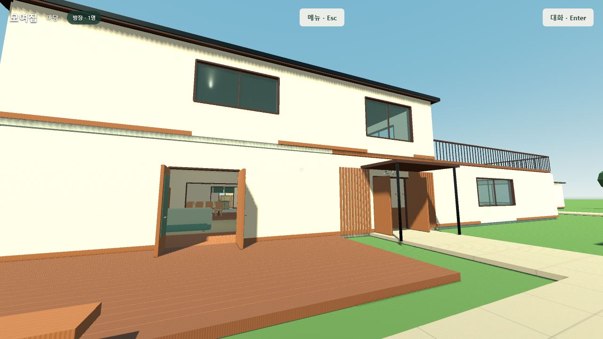

# Friendslop HomeOffice · 모여집

[웹에서 실행](https://mjayj9.github.io/Friendslop_HomeOffice/) · [한국어 실행·조작 안내](homeoffice/README.md) · [필수 미완료](homeoffice/docs/v2/required-remaining.md)

Godot 4.6.1/GDScript 기반의 2층 집+오피스 멀티플레이 게임입니다. **개발 빌드이며 원문 전체 완료가 아닙니다.** 기존 main을 보존한 `codex/godot-homeoffice-v2` 브랜치입니다.

독립 브라우저 2/4/8명 연결·개인실, 실제 이동/소품/생활, Yjs 동시 한글 보고서, PDF/레이저/주석, 음성 범위, 아케이드, 파일 복원과 정상 방장 이전을 개발·검증했습니다. 각각의 부분 시험과 남은 필수 작업은 [56개 원문](homeoffice/docs/v2/requirements-traceability.md), [80개 인수 기록](homeoffice/docs/v2/acceptance-80.md)에 구분했습니다.

같은 PC의 8개 브라우저에서 호스트 6~7fps로 성능 목표에 못 미쳤습니다. 실제 사람 마이크/STT·정밀 캐릭터 동작·수납/조명·팀 경기 규칙·전체 통합 인수 등이 남아 있습니다. 캡처는 실제 Godot 웹 화면이며 Blender 프리뷰는 art에 별도 있습니다.

- [연속 보행 영상](homeoffice/evidence/v2-walk-video/continuous-game-walk.webm)
- [층별 도면/공간 프로그램](homeoffice/docs/v2/space-program.md)
- [실제 성능 기록](homeoffice/docs/v2/performance.md)
- [한국어 합성 음성 측정](homeoffice/docs/v2/korean-stt-measurement.md)
- [라이선스 고지](homeoffice/docs/third-party-notices.md)

`homeoffice/`는 실행 가능한 소스·실제 에셋·Blender 원본·브리지·시험, `docs/`는 GitHub Pages용 Godot 웹 export입니다. Firebase·기존 프로젝트·기존 서비스 설정을 변경하지 않았습니다.
