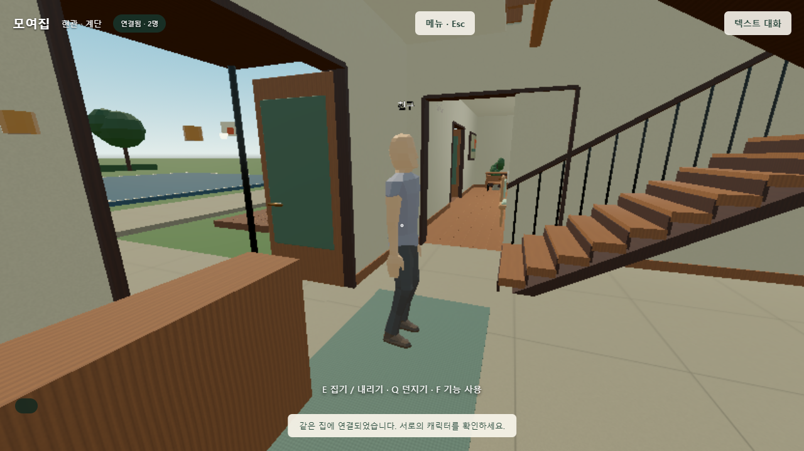

# V3 배포 경로 수리

## 재현한 원인

- 최초 V3 커밋 `4cd064e`는 `homeoffice/` 소스만 갱신했습니다.
- Pages는 `codex/homeoffice-v3:/docs`를 제공하고 있었고, 그 폴더에는 V2의 5,201바이트 HTML과 V2 PCK가 남아 있었습니다.
- 공개 주소의 `build-info.json`, `build-guard.mjs`가 실제 HTTP 404였습니다.
- 새 체크아웃에는 `.gitignore`로 제외된 `homeoffice/build/`가 없는데 개발 서버가 그 폴더만 제공했습니다.

## 수정

- 저장소의 V3 소스에서 Godot 4.6.1로 다시 export하고 실제 `/docs`에 반영합니다.
- 빌드는 기본적으로 Pages 폴더까지 함께 갱신하며, 현재 소스와 export가 다르면 검증이 실패합니다.
- 신규 체크아웃 서버는 포함된 `/docs` 배포본을 사용합니다. `--artifact published`로 명시할 수도 있습니다.
- 모든 배포 의존 파일을 해시 검증하고 Git에 저장된 blob도 검증합니다. 배포 파일의 줄바꿈 변환을 막습니다.
- GitHub 검증 작업과 배포 회귀 시험을 추가했습니다. 기존 기능 검증을 이번 공개 배포 검증으로 바꿔 적지 않습니다.

## 증거

- [수정 전 실제 공개 응답](../../evidence/v3/deployment-repair/before.json)
- [새 체크아웃 브라우저 실행 결과](../../evidence/v3/deployment-repair/clean-checkout/report.json): 실제 WebGL 시작·혼자 입장·2인 초대·몸체/이동 동기화·저장 다운로드 통과.
- [의존성 새 설치 로그](../../evidence/v3/deployment-repair/clean-install.log): 별도 npm 캐시로 lockfile의 179개 패키지 설치 성공. 기본 공유 캐시에서는 EEXIST가 발생해 재시도했습니다.
- [기존 웹 규칙 20개](../../evidence/v3/deployment-repair/node-tests.log): 모두 통과.
- 배포 회귀 6개: V2 폴더, 혼합 PCK, 누락된 하위 의존 파일, 경로 이탈, 오래된 소스를 거절하고 올바른 export를 허용합니다.
- 새 체크아웃에는 `build/`, Godot 실행 파일, 기존 의존성을 복사하지 않았습니다. 로컬 시험은 별도 HTTP 포트 8062와 기존 loopback PeerJS 신호 서버를 사용했습니다.
- [공개 Pages 실제 두 브라우저 결과](../../evidence/v3/deployment-repair/public/report.json): 공개 HTTPS 주소에서 V3 로딩, 혼자 입장, 공개 PeerJS를 통한 2인 초대, 키보드 이동·상대 몸체 표시, 실제 저장 다운로드 모두 통과. 브라우저 오류와 요청 실패 0개.
- [GitHub 검증·Pages 배포 완료 기록](../../evidence/v3/deployment-repair/deployment.json): 수정 커밋 `a03b341`, 빌드 `52b4edbc-4abd-4619-bea4-463db1278f2b`, 두 작업 모두 success.
- 위 공개 접속은 한 PC의 독립 브라우저 두 개입니다. 서로 다른 통신망 두 사람의 NAT·음성 품질 인수로 표현하지 않습니다.

