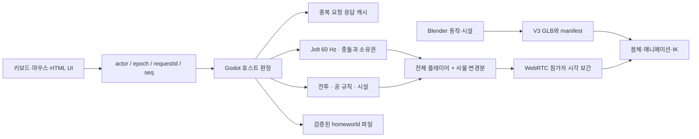

# 두 문서의 상세 분석과 V3 구현

## 1. 문서의 역할과 이번 작업 범위

`HomeOffice_PR1_Code_Audit_KO.md`는 2026-09-15의 코드·배포 아티팩트 감사입니다. F01–F16은 코드에서 확인한 사실과 해석이며, 당시 상대 캐릭터 렌더링·실제 마이크·WAN 검증이 성공했다는 문서가 아닙니다. 특히 ‘연결된 플레이어 수’와 ‘보이는 캐릭터’가 같지 않다는 지적이 핵심입니다.

`HomeOffice_V3_Repair_And_Completion_Prompt_KO.md`는 이 감사를 30개 최신 요구, 56개 기존 요구의 승계, 16개 검증 묶음으로 확장한 명세입니다. R/U/G는 각각 기능, 보존 범위, 검증 시나리오이며 102개의 서로 다른 신규 기능을 뜻하지 않습니다. 코드에 기능 이름이 있다는 사실과 사용자가 실제 조작할 수 있다는 사실도 구분해야 합니다.

사용자는 문서 분석에 이어 실제 구현을 요청했고, BlenderMCP 연결을 알려 주었으며, 이후 실제 사람·현실 환경 인수 대신 가상 시뮬레이션을 진행하도록 범위를 정했습니다. 따라서 기능 구현·로컬 실행·브라우저/엔진 검증은 수행하며, 첨부 문서에 포함된 운영 배포·외부 계정·실제 사람 시험 지시는 별도의 사용자 실행 요청으로 간주하지 않았습니다.

### 우선순위와 충돌 해결

1. 상대 몸체가 보이지 않는 P0를 먼저 재현했습니다.
2. 의자와 입력·소유권·파일 복원을 수리한 뒤 기능을 확장했습니다.
3. E는 집기/내리기, Q는 던지기, F는 기능 사용으로 통일했습니다. 이전 E 만능 사용/Q 내리기 설명은 갱신했습니다.
4. U46 미로/픽맨은 최신 R16 공룡 러너로 대체했습니다. 오래된 저장 호환 코드는 보존하되 두 게임기 모두 러너를 엽니다.
5. HP와 킬 게이지는 별도 상태로 만들었습니다. 수치 100 HP / 25 피해 / 3초 복귀 / 2초 보호 / KO당 게이지 25는 이번 구현의 기본 설계값입니다.
6. Google/Microsoft 원본 링크와 내장 Yjs 문서는 별도 기능으로 유지했습니다.

## 2. 실제로 찾은 결함과 수정

| 감사/재현 | 실제 원인 또는 관찰 | 수정과 의미 |
|---|---|---|
| F01 상대 이름만 표시 | 남자 GLB 재질의 `alphaMode=MASK`, baseColor alpha=0. 노드·스킨은 존재해도 모든 픽셀이 버려짐 | 원본 바이너리를 보존한 V3 재질 파생본. 이후 세 브라우저에서 몸체 표시를 확인 |
| F02 본 자세 손상 | 원래 rest rotation을 지우는 단순 회전 덮어쓰기, 런타임 sin 보행 | rest 회전 보존, Blender keyframe 62개, AnimationPlayer 전이, 후처리 접촉 IK |
| F03 자기 취침 불가시 | 로컬 lying 메시까지 숨김 | 같은 리깅 몸체를 취침 시 보이고 3인칭 카메라로 이동. 깨면 1인칭 복귀 |
| 의자 낙하 | 의자를 이동 가능한 RigidBody로 바꾸면서 원래 비어 있던 충돌 배열 사용 | 좌판·등받이·하부 충돌체 추가, 점유 중 고정, 비점유 때 실제 물리. E/Q/F 브라우저 회귀 |
| F04 승인 후 총 무반응 | tag가 ready인데 fire는 practice/play만 허용 | Practice 초기화, 220ms 연사 제한, 연습 무제한 탄약, 권한/총구/탄약/상태 설명 |
| F05 실제 피해 없음 | 기존 점수/토스트만 존재 | CombatState에서 피해·KO·복귀·보호·킬/사망·게이지 감소를 관리 |
| F06–F08 과대 공/림과 단순 킥 | 공 반지름 .24/.22m, 림 중심선 .43m, 고정 ID 킥 | 공 .12/.11m, 림 안쪽 .225m, 물리 프로필·회전·실제 득점·등록 공·발 터치 |
| F09 입력 불일치 | 안내/이벤트/기능에 서로 다른 키 의미 | 입력 우선순위와 안내 갱신, 한글 입력 중 이동 차단 회귀 |
| F10 불완전한 방 조명 | 스탠드 기능은 있었으나 방 스위치 없음 | HOME/OFFICE/욕실 회로, 실물 스위치·광원·동기화·저장 |
| F11 생성기 회귀 위험 | `.txt`를 합쳐 `.gd`를 다시 쓰는 생성기 | 해당 조합기를 명시적으로 중단. 런타임은 `.gd`, 제작은 데이터/에셋 스크립트 |
| F12 DOM 전용 레이저 | 발표 캔버스 포인터만 연결 | 실제 소품→물리 광선→표면 로컬 좌표→UV→권한 확인→원격 포인터 |
| F13 문서 탭 전환 시 정지 | document.hidden을 호스트 freeze로 직접 연결 | 의도적인 정지를 제거. 정상 호스트 인계 제공. 브라우저 자체 throttling은 별도 제약 |
| F14 긴 내부 ID 초대 | peer ID를 표시 코드로 사용 | AAA-AAA 표시 코드와 directory alias, URL 입장, 고정 교실 alias 분리 |
| F15 합성 STT와 실제 품질 혼동 | 기존 Whisper 경로는 있었고 6문장 수치는 사람 발화 검증이 아님 | 현재 V3에서 실제 WASM 인식·FPS를 재측정, 늦은 자막 순서/음소거 처리 강화. 사람 정확도 주장은 제외 |
| F16 8브라우저 성능 저하 | 한 PC의 8개 렌더러 부하가 분산된 8인 성능과 다름 | 변경 사물 전송·물리 sleep 유지·효과 풀링, 동일 PC 2/4/8 접속과 30분 시험을 별도 측정 |
| 복원 시 물내림 재생 | 저장된 toggle 상태를 새 이벤트로 오인 | quiet restore와 이벤트 이력 초기화. 네트워크의 새 물내림은 재생 |
| 작은 레이저 집기 실패 | 3cm 물체에 키보드 조준 오차가 충돌체 폭보다 큼 | 작은 레이저/마카만 7cm 조준 여유, 별도 장애물 광선 확인. 물리 크기는 유지 |
| 메뉴 클릭 차단 | 브라우저와 엔진의 포인터 잠금 전환이 중복됨 | 메뉴/도구 열기에 명시적 ui_focus, Godot 입력 해제. 실제 마이크 종료 클릭으로 재검증 |
| 앉은 상태 F 오작동 | 탁자/도구 기능이 V2의 일어서기보다 먼저 실행 | 앉기·취침 종료를 최우선 처리. 빈손 회의석은 R로 자료 열기. 식사 후 설거지까지 회귀 검증 |
| 욕실 모델 겹침 | V2 장식 세면대/변기에 새 시설을 겹쳐 배치 | 기존 건물 파생 GLB에서 448개 삼각형·충돌체 2개만 제거. 새 속이 빈 세면대/변기와 경첩 추가 |

### 상대 표시 결함을 판정한 순서

네트워크 roster → Godot 플레이어 인스턴스 → 남자 mesh/skin → 재질 alpha → 카메라와 실제 픽셀을 분리해 조사했습니다. 따라서 “접속 3명”만으로 가시성 수리를 판정하지 않았습니다. `baseline`, `after-material-fix`, `integrated-three` 캡처는 각각 수정 전과 수정 후 실행 자료입니다.

## 3. 코드 구조와 권위

새 책임은 `scripts/combat`, `scripts/sports`, `scripts/physics`, `scripts/player`, `scripts/interaction`, `scripts/world`, `scripts/core`와 웹의 invitations/directory/document-registry/broadcast/caption-policy/state-codec/build-guard로 나눴습니다. `scripts/v3/world.gd`가 통합하고 검증된 기존 `scripts/v2/world.gd`를 상속합니다.

이는 생성기 이중 원천을 없애고 신규 로직을 분리한 점진적 전환입니다. 기존 V2 world/bridge가 완전히 작은 모듈로 해체되었다고 주장하지 않습니다. 기존 수납·요리·보드·개인실을 한 번에 다시 생성하는 회귀를 피하기 위해 유지한 부분입니다.

### 조작 명령

- actor는 수신 연결의 실제 ID와 일치해야 합니다. payload에 적힌 호스트 ID를 신뢰하지 않습니다.
- epoch는 현재 세션과 일치해야 합니다. 호스트가 바뀌면 새 epoch를 사용합니다.
- requestId는 동일 epoch/actor에서 한 번 처리하고 최대 128개 응답을 보관합니다. 재전송은 저장된 결과를 돌려줍니다.
- seq, 크기, 데이터 타입, 동작 목록을 확인합니다. 거절은 accepted=false/reason/stateRevision을 반환합니다.
- 집기·앉기·시설 사용·배치·발사는 거리/광선/가림/점유/구역/권한을 호스트가 확인합니다.
- PeerJS 연결별 크기·속도·인원 제한과 명시적 baseline 재요청을 유지합니다.

### 상태 복제

플레이어 목록은 매 상태에 포함하고, 사물은 변경된 항목과 삭제 ID만 보냅니다. 위치/회전은 변경 감지에 1mm/.001rad, 속도는 .01 단위 양자화를 사용합니다. 실제 전송값 자체는 원래 수치입니다. 120 tick마다 기준 상태를 보내며 기준 tick이 없으면 재요청합니다. 참가자 로컬 시계가 호스트 tick을 덮어쓰지 않게 했습니다.

이 구조는 호스트 권위의 물리 상태를 복제합니다. 서로 다른 장치에서 완전히 결정적인 lockstep 물리라는 뜻이 아닙니다.

## 4. 캐릭터·접촉·생활

사용자 프로젝트의 실제 남자 mesh를 유지했습니다. 리깅은 13개 본이며 손가락/손목 전용 본은 없습니다. 새 캐릭터로 대체하지 않았고, 원본 GLB 및 기존 Blender 파일은 보존했습니다. `art/male-character-v3.blend`, `male-animated-v3.glb`에 62개의 실제 Action/클립을 만들었습니다.

클립은 root motion을 끄고 실제 수평 속도와 방향, 앉기/취침, 들고 있는 물건, 제스처와 활동에 따라 전이합니다. 몸체 이동은 CharacterBody 제어기가 맡고 IK는 최종 시각 본 자세만 수정합니다. 발은 지면 광선과 접촉 유지점을 사용하고, 손은 실제 들고 있는 물체의 그립 위치를 목표로 합니다. 리깅 길이 밖의 손 목표는 제한하며 실제 관찰에서 약 8cm 잔차가 있었으므로 모든 자세의 손/발 완전 접촉을 판정하지 않았습니다.

의자·상자·책·마카·도구·이동 가능한 책상/스탠드를 실제로 들고 놓고 던집니다. 무게에 따라 이동 속도와 던지는 속도가 달라집니다. 회의실 컴퓨터가 올라간 두 책상은 고정 설비로 설명하고 다른 일반 책상은 집을 수 있습니다. 점유 중이거나 수납물이 있는 가구의 무단 이동을 막습니다.

수면은 F 진입→같은 몸체의 bed/sleep 동작→본인 3인칭→F 깨기→안전한 출구 위치→1인칭으로 연결됩니다. 실제 계단을 올라 침대에 가고 다시 내려오는 브라우저 시험으로 확인했습니다.

욕실은 새 hollow 세면대/변기, 경첩 뚜껑, 수도의 물 메시와 반복 소리, 물내림의 제한된 재생, 회전 환기 팬과 스위치, 광원을 제공합니다. 물줄기와 물내림은 게임용 시각/음향 시뮬레이션이며 유체 역학을 구현한 것은 아닙니다.

## 5. 물리와 경기

| 항목 | 현재 구현 |
|---|---|
| 농구공 | 반지름 .12m, 질량 .62kg, CCD, friction .68, bounce .72 |
| 축구공 | 반지름 .11m, 질량 .43kg, CCD, friction .68, bounce .48 |
| 림 | 중심선 .245m, 안쪽 .225m, 방사 두께 .04m. 원본 48개 충돌체 함께 수정 |
| 슛 | 호스트가 누른 시간 확인, 속도/각도 상한, 실제 backspin 각속도, 자동 골대 흡인 없음 |
| 드리블 | 중력·바닥 반발로 튀고, 손 높이에서 제한된 하향 impulse. 수평 추종 힘·속도 제한 |
| 스틸 | 빈손·거리·시선·드리블 노출 높이·가림·재사용 대기 검사 후 loose ball |
| 축구 터치 | 근처의 등록된 공, 160ms 이상 터치 간격, 제한된 impulse. 손 점유 없이 패스/충전 슛 |
| 득점 | 농구는 유효 중심의 위→아래 통과 1회 2점, 축구 골라인 통과 1점 후 중앙 재개 |
| 경기 공 | 자유 배치 공도 동작. 정식 play 중에는 지정 경기 공만 점수에 반영 |
| 그물 | 공의 실제 위치/속도에 반응하는 시각 그물. 점수나 공의 힘을 바꾸지 않음 |
| 전투 | 100 HP, 명중 25 피해, KO 3초 후 복귀, 2초 보호, 킬 +25 게이지, 10초 무킬 후 초당 8 감소 |

숫자는 이 게임의 튜닝값입니다. 프로 스포츠 전체 규칙/물리 재현으로 표현하지 않습니다. 간단한 팀 배정은 청팀 +X, 주황팀 -X 공격이며 농구는 모두 2점입니다. 경기 시작/제한 시간/결과/재시작 경로는 기존 라운드 UI와 통합했습니다.

별도 `physics_lab.tscn`에는 평지·계단·경사·낮은 천장·문·책상과 낙하 공·얇은 벽이 있습니다. 검증은 실제 엔진에 초기 조건을 배치한 시험과 실제 브라우저에서 걸어간 시험을 구분합니다. 모든 교행·모든 가구 조합을 전수 물리 검증했다는 의미는 아닙니다.

## 6. 회의와 외부 자료

회의실은 8개 좌석과 책상, 실제 모니터·키보드·탁상 마이크, 발표 스크린, 보드, 천장 흡음 패널을 갖춘 OFFICE 구역입니다. 책상 F에서 다음 기능으로 연결됩니다. 이미 앉아 있을 때 F는 일어서기를 우선하고, 빈손 회의석에서는 R로 자료를 열고, 책을 들고 앉아 있으면 R로 읽습니다.

- Google 검색: 사용자의 검색어를 인코딩해 Google 원본 창을 엽니다. 검색어를 월드의 공개 사물 상태에 넣지 않습니다.
- Google Docs/Slides/Sheets, Microsoft OneDrive/SharePoint Excel 원본: 허용된 URL을 검증해 같은 원본 참조를 참가자에게 공유합니다. 팝업이 막히면 안내하고 원본 창을 엽니다.
- Yjs/Quill 보고서, 브레인스토밍 메모·투표, 마인드맵과 순환 금지, 공동 의제/결론, 손들기, 타이머를 보존했습니다.
- 질문 대기열과 담당자별 후속 할 일, 원격 완료/다시 열기/삭제를 추가했습니다. Yjs 연산과 저장 파일에 들어가며 항목 수·문자열·타입을 검증합니다.
- PDF/이미지는 실제 원본 바이트를 전송·검증·저장하고 페이지/주석/발표자 권한을 공유합니다. PPTX는 외부 도구에서 PDF로 내보낸 파일을 사용합니다.

문서 URL을 공유하는 기능은 구현되어 있지만 사용자 계정의 Google/Microsoft 공유 권한을 대신 발급하지 않습니다. 내장 편집기를 Google Docs/Excel이라고 부르지 않습니다. 외부 계정에서 실제 두 사람이 공동 편집하는 인수는 사용자가 지정한 이번 가상 범위 밖입니다.

### 물리 레이저

작은 실제 소품을 E로 들고 클릭을 유지하면 손의 위치에서 광선을 쏩니다. 첫 물리 충돌이 발표 표면일 때만 mesh의 local 좌표와 크기로 UV를 계산합니다. 웹은 발표 권한·현재 자료·페이지·순서를 확인하고 두 브라우저에 같은 점을 그립니다. 입력/통신이 끊기면 400–500ms 내에 지웁니다. 벽/사물 뒤 화면을 통과하지 않습니다.

## 7. 초대·교실·저장 정책

AAA-AAA 코드는 내부 peer ID와 분리된 표시용 alias입니다. 코드 자체 또는 복사한 URL을 붙여넣어 입장할 수 있고 하위 배포 경로를 보존합니다. 교실은 `room=classroom` 고정 alias를 사용합니다.

빈 교실에 동시에 들어오면 directory 이름 선점으로 한 사람만 호스트가 됩니다. 참가자는 이미 열린 호스트를 조회합니다. 정상 인계는 barrier→체크포인트 검증→확인→새 epoch→고정 alias 재선점으로 처리합니다. 최초 입장자/호스트는 교사 인증을 받은 사람이 아닙니다. 자율 교실에서는 무기·방송 관리자 권한을 부여하지 않습니다.

모두 떠나면 링크는 유지되지만 월드를 영구 보존하는 상시 서버는 없습니다. 빈 교실 재입장은 새로운 세션입니다. 보존이 필요하면 `.homeworld`를 내보내고 빈 호스트에서 가져옵니다. 강제 종료는 마지막 확인 복구본과 시점을 안내합니다. 동일 고정 주소와 영구 저장을 같은 기능으로 혼동하지 않습니다.

파일은 기존 schema 2를 유지하면서 시설 상태, 공식 문서 참조, 수동 공지를 허용 목록에 추가했습니다. Yjs 질문/할 일은 문서 update에, PDF/이미지는 첨부에 들어갑니다. transient 손/좌석 점유, 옛 연결 ID 권한, 자동 재발사 상태는 복원하지 않습니다. 제한 크기·CRC/SHA256·ID·참조·타입·허용 자산·경로를 확인하고 잘못된 파일은 현재 세계를 바꾸기 전에 거절합니다.

## 8. 음성·자막·방송

기본 마이크는 꺼져 있고 사용자가 직접 켭니다. V 눌러 말하기/열린 마이크/음소거/완전 종료를 제공합니다. 근거리/같은 물리 구역/허가된 방송석 모드는 실제 RTC 전송 경로와 음량 처리에 연결됩니다. 차단 사용자와 전달 범위를 검사합니다.

방송은 실제 콘솔 근처, 허가된 사용자, 한 명의 활성 발화자 조건을 사용합니다. 세션/HOME/OFFICE/PLAY 범위를 선택하고 ON AIR를 표시합니다. 방송 중 다른 대화와 효과음의 ducking 계수는 .35입니다. 콘솔을 떠나거나 권한을 잃으면 종료합니다. 수동 공지 최대 32개는 별도로 저장합니다.

한국어는 기존 browser/local recognition 선택과 Whisper WASM 경로를 보존했습니다. generation/utterance/sequence로 늦게 온 중간 결과가 최종 자막을 덮지 못하고 mute 이후 이전 결과를 폐기합니다. 브라우저 외부 인식으로 몰래 전환하지 않습니다. 합성 음성의 현재 실행 결과와 과거 CER/WER를 섞지 않으며 실제 사람의 정확도를 주장하지 않습니다.

## 9. 빌드·배포·보존

빌드마다 UUID와 엔진/템플릿/프로토콜/자산/저장 형식, 파일 바이트·SHA256을 생성합니다. 시작 전에 JS/PCK/WASM 등 핵심 5개 파일의 해시를 검사하고 Godot 내부 build ID와 웹 build ID도 맞춥니다. 혼합 파일을 주입한 별도 브라우저 시험에서 입장 전에 차단했습니다. 이는 모든 CDN 캐시의 원자적 배포를 보장하는 배포 시스템은 아닙니다.

기존 소스는 `evidence/v3/source-before.zip`, 입력 문서는 별도 복사/해시로 남겼습니다. V3 남자·건물·농구장·시설은 새 파일입니다. root의 다른 프로젝트와 `deployment/Friendslop_HomeOffice` 배포 클론을 변경하지 않았고 운영 배포/PR 병합은 하지 않았습니다.

## 10. 근거로 사용한 공식 자료

- [glTF 2.0 명세](https://registry.khronos.org/glTF/specs/2.0/glTF-2.0.html): alphaMode와 재질의 불투명도 처리.
- [Godot SkeletonModifier3D](https://docs.godotengine.org/en/4.6/classes/class_skeletonmodifier3d.html): 애니메이션 뒤 시각 본 보정 구조.
- [Godot Skeleton3D](https://docs.godotengine.org/en/4.6/classes/class_skeleton3d.html): 본의 rest/pose 공간.
- [Godot 4.6](https://godotengine.org/releases/4.6/): 선택한 엔진 계열과 기능 기준.
- [Google 파일 공유 안내](https://support.google.com/docs/answer/2494822): 원본 문서의 공유 권한은 제공 서비스에서 설정.

API가 있다는 사실만으로 게임 기능의 성공을 판단하지 않았습니다. 구현 판단의 근거는 별도 검증 보고서의 이번 실행 자료입니다.
