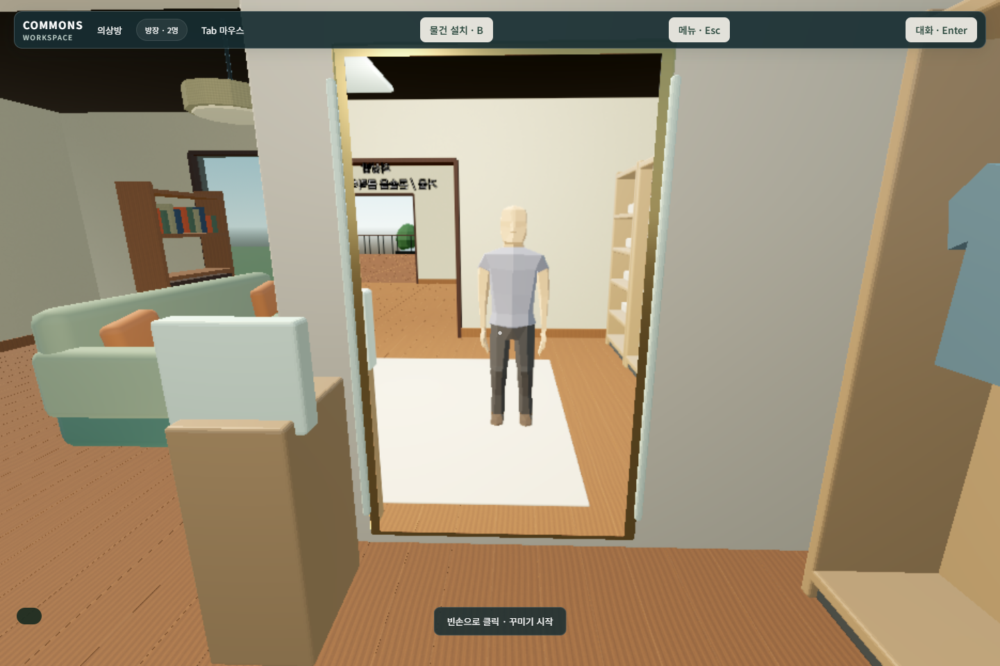
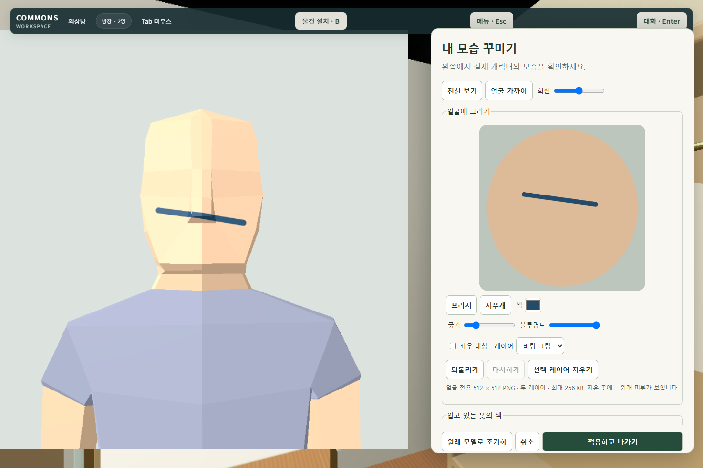
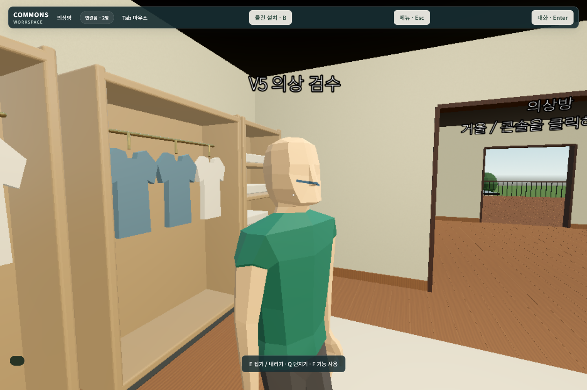

# 의상방 · 얼굴 편집 실제 검수

2026-09-17. 전체 V5 완료 판정이 아니다. 최신 실제 UI 검수 빌드는 `9fa65de6-20d0-4a7a-b315-f3b388891e24`다.

## 구현과 관찰

기존 HOME 2층 독서 가구의 좌표와 objectId를 유지하며 동쪽 5×7m 영역에 의상방을 넣었다. 기존 갤러리 입구와 서쪽 독서 공간을 연결하는 1.8m 개구부가 있다. Blender에서 수납장·선반·걸린 옷·거울·조명·콘솔·네 다리 피팅 벤치·칸막이를 만들고 GLB와 별도 충돌 계약으로 수출했다. [제작 스크립트](../../art/author_v5_wardrobe.py), [Blender 원본](../../art/wardrobe-v5.blend), [배치/충돌](../../assets/v5/wardrobe.json).

첫 브라우저 화면에서는 거울이 하늘만 반사하고 옷이 사각 덩어리로 보였다. 실제 월드를 촬영하는 off-axis frustum 거울과 렌더 전용 자기 몸 복사본을 추가했다. 복사본에는 물리 충돌이나 게임 권한이 없다. 거울 갱신은 근거리에서 최대 20Hz, 288×504다. 걸린 옷은 목·어깨·소매·몸통을 가진 메시로 수정했다. [거울 코드](../../scripts/wardrobe/mirror.gd), [Godot 4.6 Camera3D 참고](https://docs.godotengine.org/en/4.6/classes/class_camera3d.html).

남자 원본의 정점 좌표와 리그를 바꾸지 않고 파생 GLB의 앞쪽 얼굴 62개 면에 별도 `V5_Face` 재질과 UV를 부여했다. 얼굴 캔버스는 512×512 PNG, 최대 256KB, 두 레이어다. 브러시·색·굵기·불투명도·지우개·Undo/Redo·대칭·레이어 지우기·원래 모델 초기화가 있다. 별도 Godot 3D viewport에서 동일한 GLB를 회전하고 확대한다. 그린 픽셀이 실제 얼굴 재질에 적용되며, 초기화/지우개는 원본 피부를 드러낸다. [UV 계약](../../assets/characters/face-uv-v5.json), [편집 UI](../../web/wardrobe.mjs), [검증/재질](../../scripts/wardrobe/appearance.gd).

입장은 해당 방 내부에서 빈손으로 거울/콘솔을 직접 클릭하는 경로다. 단축키·메뉴·지도 진입을 추가하지 않았다. 호스트가 위치·실제 target ray·actor·epoch를 검사하고 편집 세션을 발급한다. 적용 요청에는 그 세션이 필요하며 위치 이탈·KO·인계·적용 완료로 폐기한다. 초안은 로컬 미리보기에만 쓰고, 적용한 프로필만 해당 actor에 반영해 상대에게 보낸다. PNG 서명·헤더·디코드·고정 해상도·용량·SHA256과 허용 팔레트 필드를 검증한다. 원본 재질을 사용자별로 복제해 다른 사람의 얼굴을 바꾸지 않는다.

## 이번 실행 증거

- [독립 브라우저 2개 실제 조작 13검사](../../evidence/v5/wardrobe-browser-final/report.json): 계단 보행, 콘솔 클릭, 브러시/지우개/Undo/Redo, 회전, 취소, 적용, 상대의 초안 미수신, 확정 얼굴 수신, 상대 재질 유지, 같은 브라우저 재접속. 실제 WebM 두 개의 경로가 보고서에 있다. 마이크·외부 계정 시험은 아니다.
- [엔진 21검사](../../evidence/v5/engine/9fa65de6-20d0-4a7a-b315-f3b388891e24/wardrobe-engine.json): PNG/코드 거절, 세션·장소·다른 재질 격리, 충돌하는 예전 저장의 원자적 거절, 외형 인계. 이 검사의 actor 위치 설정은 fixture이며 실제 보행으로 세지 않는다.
- 최초 구현의 [9개 UI 검사](../../evidence/v5/wardrobe-browser/report.json)와 [첫 두 브라우저 검사](../../evidence/v5/wardrobe-browser-two-peers/report.json)도 보존했다. 후자의 상대 화면은 뒷모습이라 얼굴 확인 근거로 삼지 않고, 아래 정면에 가까운 관찰을 다시 촬영했다.

방장 인계 경로를 읽다가 가구의 holder collision exception이 다시 추가되는 결함도 찾았다. 의자·테이블·낮은 테이블은 인계 후에도 몸과 충돌한다. [운반 6검사](../../evidence/v5/engine/9fa65de6-20d0-4a7a-b315-f3b388891e24/carry-volume.json)에는 해당 재현이 포함된다.

## 아직 인수하지 못한 부분

- 현재 의상 편집은 입고 있는 상의·하의·신발의 색 변경이다. 옷 메시 교체, 키/어깨/몸통/사지 비율, 체형별 리그·카메라·capsule·손/발/좌석 fitting은 구현·인수하지 않았다. 이를 대신하는 미검증 slider나 가짜 선택 버튼을 넣지 않았다.
- 얼굴 프로필은 세션의 실제 transport actor에 묶여 적용되고 같은 브라우저의 저장된 식별자에 보관된다. 로그인 계정/다른 기기의 소유권 연동은 미구현이다. 얼굴·의상 프로필을 전체 `.homeworld`에 넣는 버전별 사용자 매핑/래스터 복원도 남아 있다. 재접속 성공은 이 전체 저장 요구의 합격이 아니다.
- 기존 기본 가구가 보존되는 것은 검사했다. 임의의 예전 사용자 가구가 새 구조와 겹치면 **복원 전 중단하고 현재 세계와 원본 파일을 유지**한다. 충돌 가구의 안전한 재배치를 포함한 전체 건축 마이그레이션은 아직 없다.
- 피팅 벤치에는 실제 지지대와 충돌이 있지만 별도 착석 슬롯은 아직 없다. 거울은 브라우저 2개에서 현재 장면을 확인했으며 모든 카메라 각도/하드웨어 성능은 미검수다. 기존 검은 천장 표현, 원본의 단순한 얼굴·손 리그 등 미술 품질도 최종 인수 대상이다.

공개 Pages와 운영 인증 설정은 변경하지 않았다. 전체 건축 재설계, 체형 fitting, 완결 스포츠/전술 게임, 실제 회의/마이크/계정 인수는 [전체 추적표](verification-ko.md)에 계속 미완료로 표시한다.
